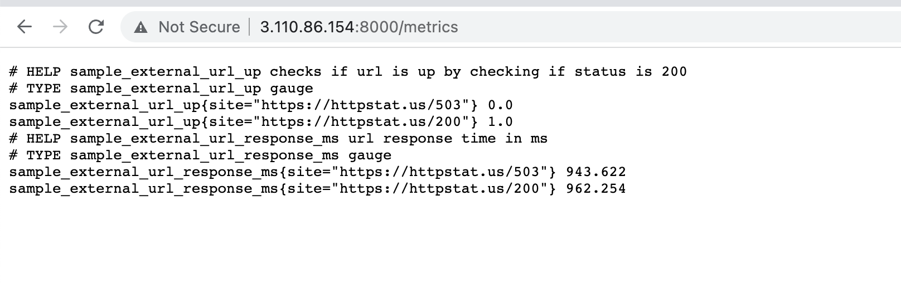
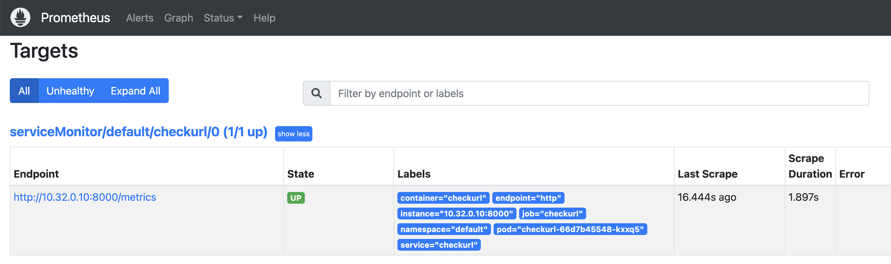
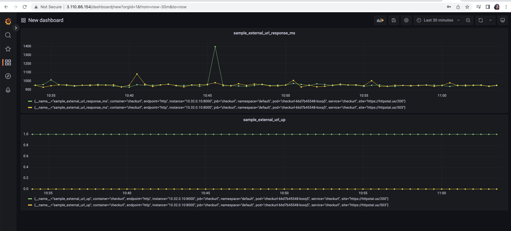

# checkurl
Python program to check the status of url using status codes

- Checkurl queries 2 urls (https://httpstat.us/503 & https://httpstat.us/200)
- It checks the external urls (https://httpstat.us/503 & https://httpstat.us/200 ) are up (based on http status code 200) and response time in milliseconds
- It runs simple http service that produces metrics using appropriate Prometheus libraries and outputs on /metrics

Expected response format:
- sample_external_url_up{url="https://httpstat.us/503 "}  = 0
- sample_external_url_response_ms{url="https://httpstat.us/503 "}  = [value]
- sample_external_url_up{url="https://httpstat.us/200 "}  = 1
- sample_external_url_response_ms{url="https://httpstat.us/200 "}  = [value]

### Note

The docker image created using the above `Dockerfile` is present in dockerhub as `meghjangi/checkurl:v2`

Above `kubernetesdeployment.yaml` file can be used to create a deployment, service and servicemonitor within a Kubernetes cluster with Prometheus and Grafana configured. 

Screenshots from Prometheus UI and Grafana dashboard below:

App metrics

App in Prometheus targets

Grafana Dashboard for `sample_external_url_up` and `sample_external_url_response_ms`

